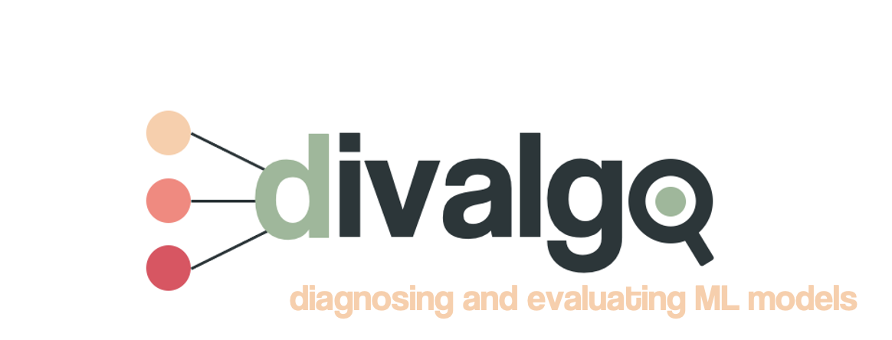
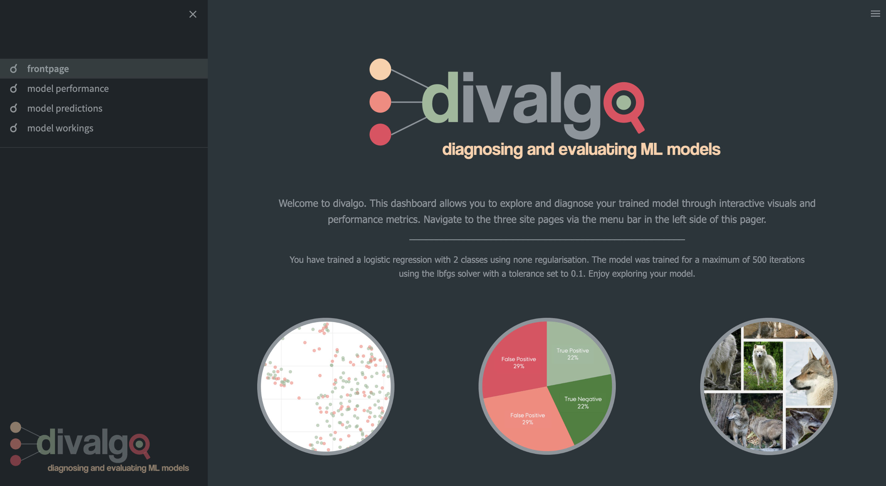

<p align="center">
    
  </a>


<br />
  <h1 align="center">divalgo - an interactive tool for diagnosing and evaluating machine learning algorithms
 </h1>
 <h2 align="center">Human Computer Interaction Exam 2022</h2>

  <p align="center">
    Frida Hæstrup, Stine Nyhus Larsen and Jakob Grøhn Damgaard
    <br />
</p>

<!-- TABLE OF CONTENTS -->
<details open="open">
  <summary>Table of Contents</summary>
  <ol>
    <li><a href="#about-the-project">About the project</a></li>
    <li><a href="#getting-started">Getting started</a></li>
    <li><a href="#repository-structure">Repository structure</a></li>
  </ol>
</details>

<!-- ABOUT THE PROJECT -->
## About the project

This project contains the exam for the course Human Computer Interaction. 
It consists of a streamlit dashboard for visualizating trained machine learning models. 

## What is divalgo?
**divalgo** is a Python tool comprising both an interactive dashboard and standalone functionalities for diagnosing and evaluating classification models. **divalgo** was developed with the aim of addressing problems of explainability and biases of prediction errors in machine learning models.
It consists of a Python class that holds a range of functionalities, all centered around demystifying
trained image classification machine learning models using engaging data and model visualisations. The main element of the tool is an interactive Streamlit dashboard for
exploring model predictions and workings, designed to be easy and informative for users who are
still relatively new to machine learning. With **divalgo** we wish to contribute to the line of work on demystifying machine learning models and improving understanding and safety of complex algorithms. We further want to address the problem with errors in machine learning models and take advantage of the immense power of user-engaging visualisations to delve into and potentially diagnose avoidable flaws and biases in models. In this alpha version of the tool, it has been decided to place our focus on models built for image classification.

<!-- GETTING STARTED -->
## Getting started
The tools is compatible with models from the sci-kit learn package (Pedregosa et al., 2011). After fitting a model, the tool may be instantiated. Below is a mock example of how the tool is initiated and the dashboard launched in Python:

```bash
model_eval = divalgo.Evaluate((X_test, y_test, filenames_test), model)
model_eval.open_visualization()
```

For examining and using the tool, we recommend following the steps below in your bash-terminal. Use the demo explained later to test out the tool.

### Cloning repository and creating virtual environment

To obtain the the code, clone the following repository.

```bash
git clone https://github.com/bokajgd/hci-divalgo.git
cd hci-divalgo
```

### Virtual environment

Create and activate a new virtual environment your preferred way, and install the required packages in the requirements file.
Using pip, it is done by running

```bash
python3 -m venv divalgo
source divalgo/bin/activate
pip install -r requirements.txt
```

### Run the demo
This repository comes with a Jupyter notebook (divalgo/demo.ipynb) demonstrating the visualization tool, using the dataset 'dogs vs wolfs' from Kaggle. We recommend all users to get acquainted with the tool by running through this demo.
The dataset used for the demo can be found <a href="https://www.kaggle.com/datasets/harishvutukuri/dogs-vs-wolves">here</a>.
To run the demonstration, download the data and place the 'data' folder in the top level of the project folder (see folder structure below). 
Then navigate to the directory of the demonstration notebook by running

```bash
cd divalgo
```
Open and run the notebook (demo.ipynb) to follow the demonstration. The final chunk in the demo opens the interactive dashboard in your browser. Feel free to explore all the functionalities of the dashboard.


## Dashboard Structure
The dashboard consists of a front page and three pages containing various functions. The content and functions of each page is shown and described below.


### Front Page
Upon launching the dashboard, the user lands on the front page. In addition to the logo, the landing page includes a short description of the dashboard functionalities and structure as well as a short prosaic description of the model that was passed to the class. This allows the use to quickly determine that everything has been initiated correctly.

<p align="center">
    
</a>

### Model Performance
The first page is intended to provide the user with a general overview of the predictive performance of the model, akin to the kind of explorations commonly undertaken when evaluating a model. It displays a table with performancee metrics, an AUC-ROC curve, a pie chart showing performance accuracies and a confusion matrix.


### Model Predictions
The second page, allows the user to sample images from the test set. The idea is to allow the user to look for consistencies in false predictions by adjusting various variables.


### Model Workings
The third page comprises the main capacities to delve into the model workings. This page enables the user to intuitively engage with the image data in direct relation to the predictions made by the model. The main element of the page is a large interactive scatterplot that shows embeddings of the test images projected onto a 2D plane. Furthermore, the page contains coefficient heatmaps that enable the user to investigate the average influence of the individual pixels in the model predictions.


<!-- REPOSITORY STRUCTURE -->
## Repository structure

This repository has the following structure:

```
├── .streamlit             <- folder with app setup configuration file
├── divalgo                <- main folder with class and functions                      
│   ├── .streamlit         <- folder with app setup configuration file
│   ├── logos              <- logo and symbols for pages
|   |   └── ...
│   ├── pages              <- folder containing subpages for the streamlit app
|   |   └── ...
│   ├── demo.ipynb         <- jupyter notebook demonstrating the use of the class
│   ├── divalgo_class.py   <- script with class and main functions 
│   ├── utils.py           <- script with helper-functions for the class and app 
│   └── ☌frontpage.py      <- main streamlit file and frontpage
├── data                   <- folder containing the data - dogs vs wolf from Kaggle for the demonstration     
|   ├── dogs               <- folder containing images of dogs
|   └── wolves             <- folder containing images of wolves
├── .gitignore                 
├── README.md              <- the top-level README
└── requirements.txt       <- required packages
```


## Biliography
Pedregosa, F., Varoquaux, G., Gramfort, A., Michel, V., Thirion, B., Grisel, O., ... & Duchesnay, E. (2011). Scikit-learn: Machine learning in Python. the Journal of machine Learning research, 12, 2825-2830.
