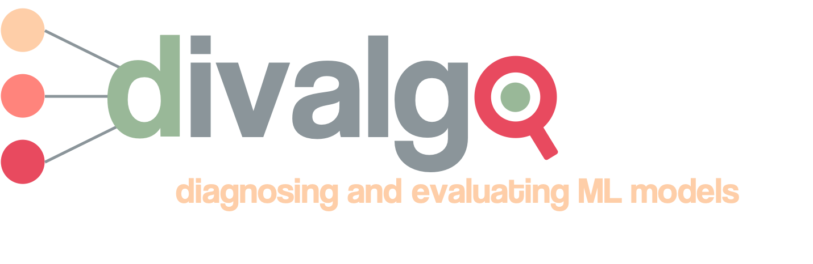

<p align="center">
    
  </a>


<br />
  <h1 align="center">Divalgo - An interactive tool for diagnosing and evaluating machine learning algorithms
 </h1>
 <h1 align="center">Human Computer Interaction Exam 2022</h1>

  <p align="center">
    Frida Hæstrup, Stine Nyhus Larsen and Jakob Grøhn Damgaard
    <br />
</p>

<!-- TABLE OF CONTENTS -->
<details open="open">
  <summary>Table of Contents</summary>
  <ol>
    <li><a href="#about-the-project">About the project</a></li>
    <li><a href="#getting-started">Getting started</a></li>
    <li><a href="#repository-structure">Repository structure</a></li>
  </ol>
</details>

<!-- ABOUT THE PROJECT -->
## About the project

This project contains the exam for the course Human Computer Interaction.

## Abstract
An interactive tool for diagnoising and evaluating machine learning algorithms.

<!-- GETTING STARTED -->
## Getting started

For running the scripts, we recommend following the below steps in your bash-terminal. 

### Cloning repository and creating virtual environment

The below code will clone the repository.

__MAC/LINUX/WORKER02__
```bash
git clone https://github.com/bokajgd/hci-divalgo.git
cd data-science-exam
```
__WINDOWS:__
```bash
git clone https://github.com/bokajgd/hci-divalgo.git
cd data-science-exam
```

### Virtual environment

As the code runs on a number of dependencies that may be prone to changes, please use the included file  ```requirements.txt``` to setup a virtual environment.

After cloning the repo, creating the virtual environment you should be ready to go.

<!-- REPOSITORY STRUCTURE -->
## Repository structure

This repository has the following structure:

```
├── .streamlit             <- folder with app setup configuration file
├── divalgo                <- main folder with class and functions                      
│   ├── .streamlit         <- folder with app setup configuration file
│   ├── logos              <- logo and symbols for pages
|   |   └── ...
│   ├── pages              <- folder containing subpages for the streamlit app
|   |   └── ...
│   ├── demo.ipynb         <- jupyter notebook demonstrating the use of the class
│   ├── divalgo_class.py   <- script with class and main functions 
│   ├── utils.py           <- script with helper-functions for the class and app 
│   └──🚪frontpage.py      <- main streamlit file and frontpage
├── .gitignore                 
├── synopsis.pdf           <- the synopsis for the project
├── README.md              <- the top-level README
└── requirements.txt       <- required packages
```
